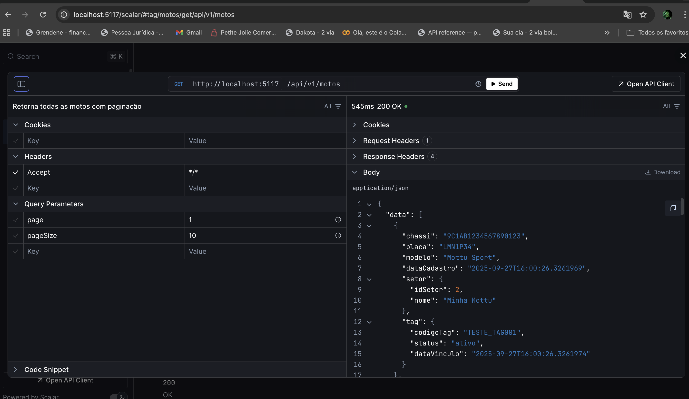
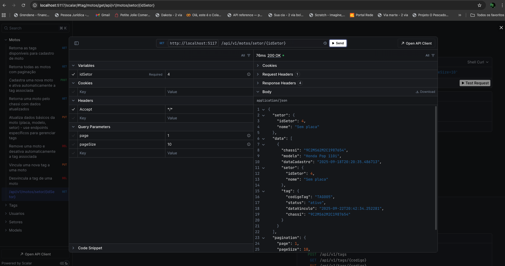
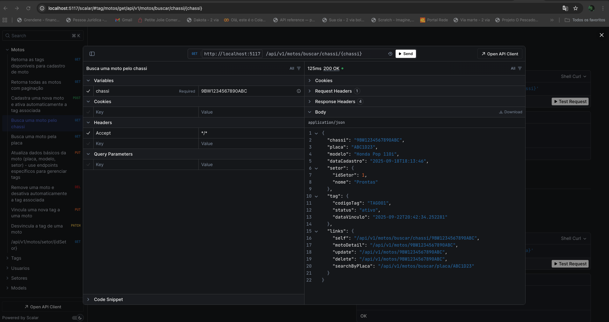
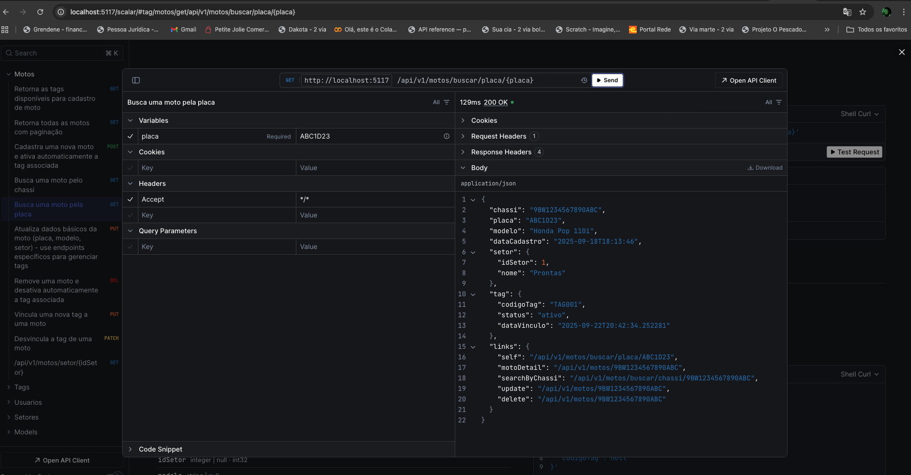
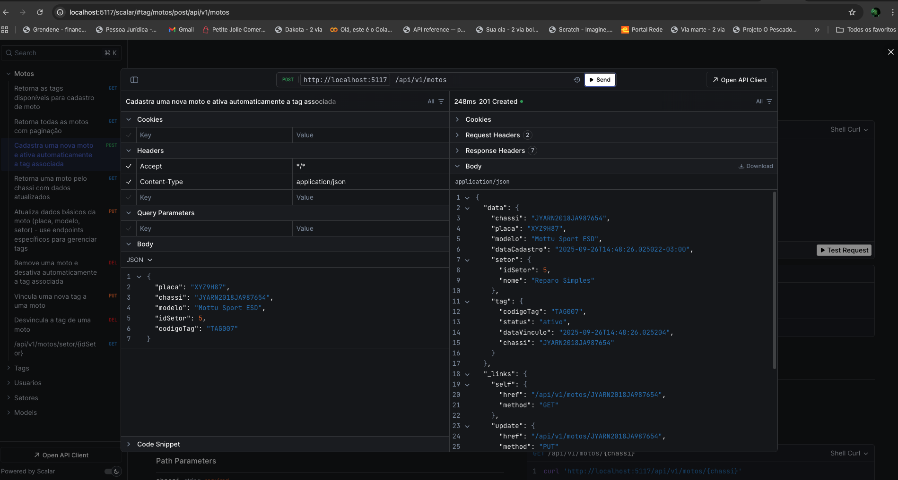
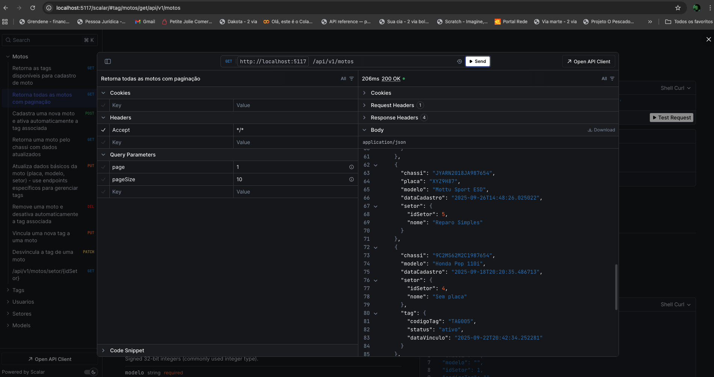
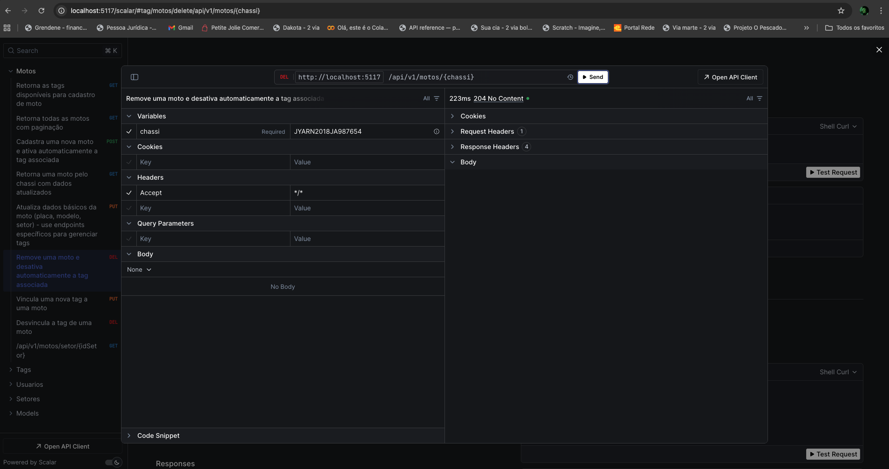
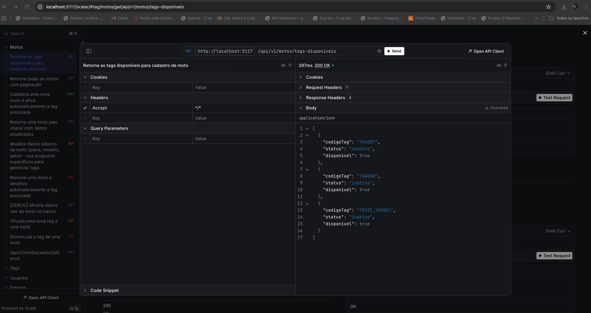
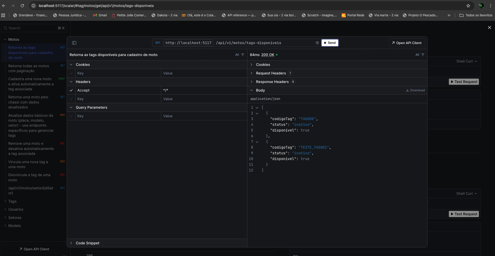
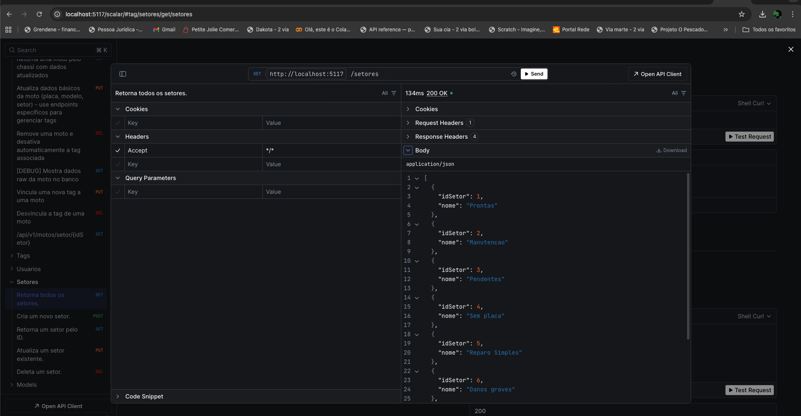

````markdown
# Tracking Code API - Sistema de Rastreamento de Motocicletas

---

## 👥 Integrantes

| Nome | RM |
| :--- | :--- |
| [Nathália Gomes da Silva] | RM554945 |
| [Nathan Magno Gustavo Consolo] | RM558987 |
| [Júlio César Nunes Oliveira] | RM557774 |

---

## 📋 Justificativa da Arquitetura

### Domínio Escolhido

**Sistema de Rastreamento de Motocicletas via RFID**

Este sistema foi desenvolvido para gerenciar o rastreamento de **motocicletas corporativas** através de tags **RFID** em diferentes setores de uma empresa ou organização. O domínio foi escolhido por representar um caso de uso real e relevante para gestão de frotas e controle de ativos.

### Entidades Principais

| Entidade | Atributos Principais | Justificativa |
| :--- | :--- | :--- |
| **Moto** | Chassi (PK), Placa, Modelo, DataCadastro, IdSetor (FK), CodigoTag (FK) | Núcleo do sistema, contém as informações essenciais do veículo |
| **Tag** | CodigoTag (PK), Status, DataVinculo, Chassi (FK *nullable*) | Gerencia os dispositivos de rastreamento e seu ciclo de vida (ativo/inativo) |
| **Setor** | IdSetor (PK), Nome | Organiza espacialmente os veículos facilitando controle e gestão |
| **Usuario** | IdFuncionario (PK), Email, Senha, Funcao | Controle de acesso e auditoria das operações |

### Padrão Arquitetural

**Minimal API com Clean Architecture simplificada** (baseado em .NET 8/9):

* **Camada de Apresentação:** Endpoints HTTP com validações e transformações.
* **Camada de Aplicação:** DTOs para contratos de entrada/saída da API.
* **Camada de Domínio:** Entidades com regras de negócio encapsuladas.
* **Camada de Infraestrutura:** `DbContext` (EF Core) para persistência em **Oracle**.

### Recursos Implementados

* **HATEOAS** para hipermídia (navegabilidade da API).
* **Paginação** em coleções grandes.
* **Health Checks** para monitoramento.
* **Rate Limiting** para proteção contra abuso.
* **Idempotência** em operações críticas (ex: criação de usuário).
* **OpenAPI/Swagger** (com Scalar) para documentação interativa.
* **Versionamento** de API (via URL, `/api/v1/`).

---

## 🚀 Instruções de Execução

### Pré-requisitos

* **.NET 8.0 SDK** (ou superior)
* **Oracle Database 19c** (ou superior, ou Oracle XE para desenvolvimento)
* **Visual Studio 2022**, Rider ou VS Code com C# extension

### Configuração do Ambiente

1.  **Clone o repositório**
    ```bash
    git clone <https://github.com/Lugia-Code/tracking-code-api.git>
    cd tracking-code-api
    ```

2.  **Configure a Connection String**
    Edite o arquivo `appsettings.json` ou `appsettings.Development.json` e defina a string de conexão do Oracle:
    ```json
    {
      "ConnectionStrings": {
        "FiapOracleDb": "Data Source=(DESCRIPTION=(ADDRESS=(PROTOCOL=TCP)(HOST=localhost)(PORT=1521))(CONNECT_DATA=(SERVICE_NAME=XEPDB1)));User Id=seu_usuario;Password=sua_senha;"
      }
    }
    ```

3.  **Execute as Migrations**
    ```bash
    dotnet ef database update
    ```
    

4.  **Execute a aplicação**
    ```bash
    dotnet run
    ```

### Acessando a API

| Recurso | URL Padrão |
| :--- | :--- |
| **API Base URL** | `[https://localhost:7xxx](http://localhost:5117/)` ou  |
| **Documentação Swagger (Scalar)** | `[https://localhost:7xxx](http://localhost:5117/scalar)/scalar/v1` (*Apenas em $\text{Development}$*) |
| **Health Check** | `[https://localhost:7xxx](http://localhost:5117/scalar)/health` |
| **Health Dashboard** | `[https://localhost:7xxx](http://localhost:5117/scalar)/health-ui` |

---

## 📚 Exemplos de Uso dos Endpoints

### 🏍️ Motos

| Ação | Método | Endpoint | Observações |
| :--- | :--- | :--- | :--- |
| Listar todas | `GET` | `/api/v1/motos?page=1&pageSize=10` | Inclui paginação e links HATEOAS. |  |
| Buscar por chassi | `GET` | `/api/v1/motos/buscar/chassi/9BWZZZ377VT004251` | |
| Buscar por placa | `GET` | `/api/v1/motos/buscar/placa/ABC1234` | |
| Listar por setor | `GET` | `/api/v1/motos/setor/1?page=1&pageSize=10` | |
| **Criar nova moto** | `POST` | `/api/v1/motos` | **(ADICIONE PRINT DA RESPONSE DO SCALAR AQUI)** |
| **Atualizar moto** | `PUT` | `/api/v1/motos/9BWZZZ377VT004251` | **(ADICIONE PRINT DA RESPONSE DO SCALAR AQUI)** |
| Vincular nova tag | `PUT` | `/api/v1/motos/9BWZZZ377VT004251/tag` | Body: `{"codigoTag": "TAG002"}` |
| Desvincular tag | `PATCH` | `/api/v1/motos/9BWZZZ377VT004251/desvincular-tag` | |
| **Deletar moto** | `DELETE` | `/api/v1/motos/9BWZZZ377VT004251` | **(ADICIONE PRINT DA RESPONSE DO SCALAR AQUI)** |

#### Exemplo de Resposta de Lista (200 OK)
```json
{
  "data": [
    {
      "chassi": "9C2MS62M2C1987654",
      "modelo": "Honda Pop 110i",
      "dataCadastro": "2025-09-18T20:20:35.486713",
      "setor": {
        "idSetor": 4,
        "nome": "Sem placa"
      },
      "tag": {
        "codigoTag": "TAG005",
        "status": "ativo",
        "dataVinculo": "2025-09-22T20:42:34.252281"
      }
    }
  ],
  "pagination": {
    "page": 1,
    "pageSize": 10,
    "totalCount": 11,
    "totalPages": 2
  }
}
````

## 📚 Exemplos de Uso dos Endpoints (Com Prints do Scalar)

Os exemplos a seguir mostram as requisições HTTP e as respostas obtidas no ambiente de desenvolvimento usando o Scalar (Swagger).

### 🏍️ Motos

| Ação | Método | Endpoint | Observações |
| :--- | :--- | :--- | :--- |
| Listar todas (com paginação) | `GET` | `/api/v1/motos?page=1&pageSize=10` | Inclui paginação e HATEOAS.  |
| Listar por setor | `GET` | `/api/v1/motos/setor/1?page=1&pageSize=10` | Filtra por setor.  |
| Buscar por chassi | `GET` | `/api/v1/motos/buscar/chassi/9BWZZZ377VT004251` | Busca específica.  |
| Buscar por placa | `GET` | `/api/v1/motos/buscar/placa/ABC1234` | Busca específica.  |
| **Criar nova moto** | `POST` | `/api/v1/motos` | Resposta **201 Created**.  |
| **Desvincular tag** | `PATCH` | `/api/v1/motos/9BWZZZ377VT004251/desvincular-tag` | Resposta **200 OK**.  |
| Moto Pós Desvínculo | `GET` | `/api/v1/motos/buscar/chassi/9BWZZZ377VT004251` | Verifica a moto sem a tag.  |
| **Deletar moto** | `DELETE` | `/api/v1/motos/9BWZZZ377VT004251` | Resposta **204 No Content**.  |

<br>

### 🏷️ Tags

| Ação | Método | Endpoint | Observações |
| :--- | :--- | :--- | :--- |
| Listar tags disponíveis | `GET` | `/api/v1/motos/tags-disponiveis` | Retorna tags sem vínculo (antes da associação).  |
| Tags Pós Associação | `GET` | `/api/v1/motos/tags-disponiveis` | Retorna tags sem vínculo (depois da associação).  |

<br>

### 🏢 Setores

| Ação | Método | Endpoint | Observações |
| :--- | :--- | :--- | :--- |
| Listar todos os setores | `GET` | `/setores` | Retorna todos os setores cadastrados.  |

<br>

-----

## 🧪 Testes

O projeto possui **12 testes automatizados** para validar os endpoints da API.

### Execução

Para executar todos os testes, use o comando:

```bash
cd tracking_code_api.Tests
dotnet test
```

Para mais detalhes, use:

```bash
dotnet test --logger "console;verbosity=detailed"
```

### Cobertura de Testes

| Arquivo de Teste | Qtd. Testes | Escopo |
| :--- | :--- | :--- |
| `MotoEndpointsTests` | 6 testes | GET endpoints, paginação e validações. |
| `TagEndpointsTests` | 3 testes | CRUD básico de Tags. |
| `SetorEndpointsTests` | 3 testes | CRUD básico de Setores. |
| **Total** | **12 testes** | |

Os testes validam:

  * Operações `GET` em todos os endpoints.
  * Códigos de status HTTP corretos ($\text{200, 201, 204, 400, 404}$).
  * Estrutura de resposta da API e Paginação.

-----

## 📊 Health Checks

O sistema utiliza **Health Checks** para monitoramento.

### Endpoint de Saúde

```bash
GET /health
```

#### Resposta Saudável (200 OK)

```json
{
  "status": "Healthy",
  "totalDuration": "00:00:00.0234567",
  "entries": {
    "OracleDb-check": {
      "status": "Healthy",
      "duration": "00:00:00.0123456"
    }
  }
}
```

### Dashboard

Acesse o dashboard de Health Checks para uma visão amigável:
`https://localhost:7xxx/health-ui`

-----

## 🔒 Rate Limiting

A API possui **Rate Limiting** configurado para proteção contra abuso.

  * **Limite:** 10 requisições por minuto por IP.
  * **Resposta quando excedido ($\text{429 Too Many Requests}$):**
    > Muitas requisições, tente novamente em 60 segundos

Para desabilitar em desenvolvimento, comente a linha no `Program.cs`:

```csharp
// app.UseRateLimiter();
```

-----

## 📖 Tecnologias Utilizadas

  * **.NET 9.0:** Framework principal
  * **Entity Framework Core:** ORM para acesso a dados
  * **Oracle Database:** Banco de dados relacional
  * **Swagger/Scalar:** Documentação interativa da API
  * **IdempotentAPI:** Biblioteca para idempotência
  * **AspNetCore.HealthChecks:** Monitoramento de saúde
  * **Asp.Versioning:** Versionamento de API
  * **xUnit:** Framework de testes
  * **FluentAssertions:** Asserções fluentes para testes

-----

## 🎯 Conceitos REST Implementados

| Conceito | Status | Descrição |
| :--- | :--- | :--- |
| **Recursos bem definidos** | ✅ | URIs claras e semânticas. |
| **Verbos HTTP corretos** | ✅ | Uso de $\text{GET, POST, PUT, PATCH, DELETE}$. |
| **Status codes apropriados** | ✅ | Uso de $\text{200, 201, 204, 400, 404, 429, 500}$. |
| **HATEOAS** | ✅ | Uso de *Hypermedia as the Engine of Application State*. |
| **Paginação** | ✅ | Para coleções grandes de recursos. |
| **Idempotência** | ✅ | Em operações críticas (ex: $\text{POST}$ de usuário). |
| **Versionamento** | ✅ | Via URL e headers ($\text{/api/v1/}$). |
| **Content negotiation** | ✅ | JSON como formato principal. |
| **Stateless** | ✅ | Sem sessão no servidor. |

-----

## 📝 Licença

Este projeto foi desenvolvido para fins acadêmicos na **FIAP**.
